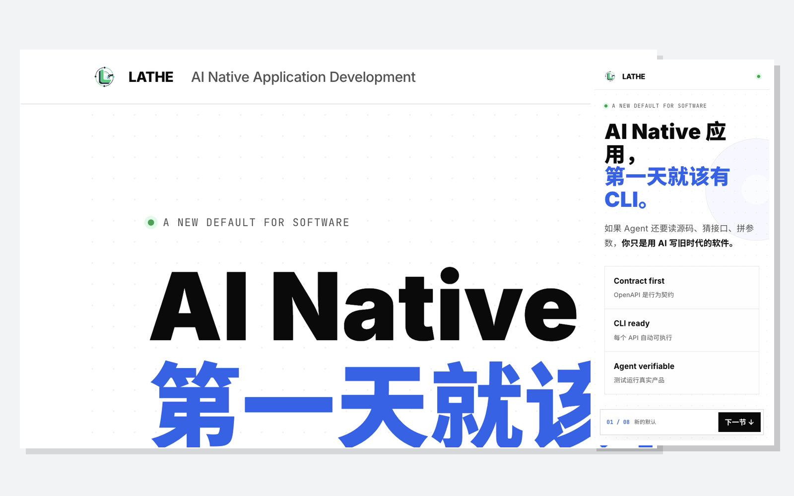
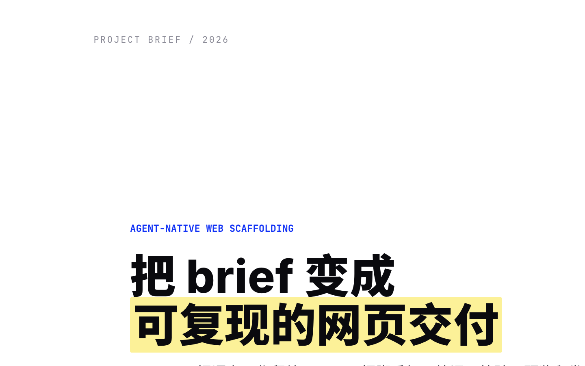
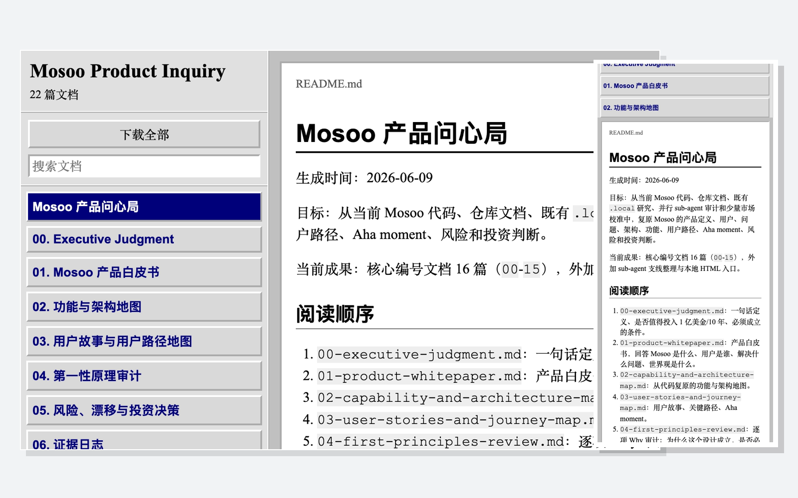

# blueprint

blueprint turns a conversational web brief into deterministic, portable output.

- The CLI owns presets, validation, preview, deployment, and project metadata.
- The bundled Agent Skill owns preset selection, research, writing, and visual review.

## Showcase

Blueprint currently ships three visual theme families. Click a screenshot to open the live output.

| Pitch | Briefing | Archive(Win 98) |
|---|---|---|
| [](https://lathe-ai-native-pitch.samzong.workers.dev/) | [](https://blueprint-session-briefing.samzong.workers.dev/) | [](https://mosoo-product-inquiry.samzong.workers.dev/) |
| [Lathe](https://github.com/lathe-cli/lathe) · `pitch` | [Blueprint](https://github.com/samzong/blueprint) · `briefing` | [Mosoo](https://github.com/langgenius/mosoo) · `archive` |

## Install

```bash
brew tap samzong/tap
brew trust samzong/tap
brew install blueprint
```

Homebrew installs Node.js, `gofs`, and Wrangler as dependencies.

Copy this prompt to your agent:

```text
Install Blueprint and its bundled Agent Skill for your current agent: run brew tap samzong/tap, brew trust samzong/tap, brew install blueprint, and blueprint skill install, then verify the installation with blueprint --version.
```

## Quick start

```bash
blueprint create pitch .local/demo
blueprint check .local/demo
blueprint preview .local/demo
blueprint --help
```

Available presets:

| Preset | Output |
|---|---|
| `pitch` | Compiled single-file story |
| `briefing` | Compiled single-file slide deck |
| `archive` | Compiled searchable Markdown reader |
| `prototype-lite` | Single-file React prototype |
| `prototype-full` | Vite + React + TypeScript prototype |
| `dossier` | Maintained Vite + React + TypeScript report |

Every successful `create` writes `.blueprint.json` with the project identity, entry point, preset, blueprint version, and latest verified deployment. Rebuilding preserves the project ID and deployment record.

`blueprint list` discovers projects under the current directory. Use `--root <path>` to change the scan root and `--json` for machine-readable output.

## Deploy

Deployment requires Wrangler 4+:

```bash
wrangler login
blueprint deploy .local/demo --name repo-task
```

`deploy` validates a managed project, publishes it through Cloudflare Workers Static Assets, verifies the URL, and records the result in `.blueprint.json`.

Single-file presets may be deployed from the project directory. For `prototype-full` and `dossier`, run `pnpm build` in the project and deploy its `dist` directory.

`--account` is usually unnecessary. blueprint reuses the recorded account, `CLOUDFLARE_ACCOUNT_ID`, or the only available account. The bundled skill derives Worker names as `<repo-name>-<task-name>` inside a Git repository and `<task-name>` elsewhere.

## Install the Agent Skill

```bash
blueprint skill install
```

The installer uses `@kitup/sdk` to detect supported agents, select user or project scope, and protect unmanaged targets from accidental overwrite. Run `blueprint skill install --help` for host, scope, dry-run, and overwrite options.

## Development

Development requires Node.js 24+ and pnpm 10.

```bash
pnpm install
pnpm check
npm pack
```

`npm pack` builds the GitHub Release artifact.

## Acknowledgements

blueprint directly uses:

- [gofs](https://github.com/samzong/gofs) for single-file local preview serving
- [@kitup/sdk](https://github.com/lathe-cli/kitup) for bundled Agent Skill installation
- [Wrangler](https://github.com/cloudflare/workers-sdk/tree/main/packages/wrangler) and [Cloudflare Workers](https://developers.cloudflare.com/workers/) for deployment

## License

MIT
